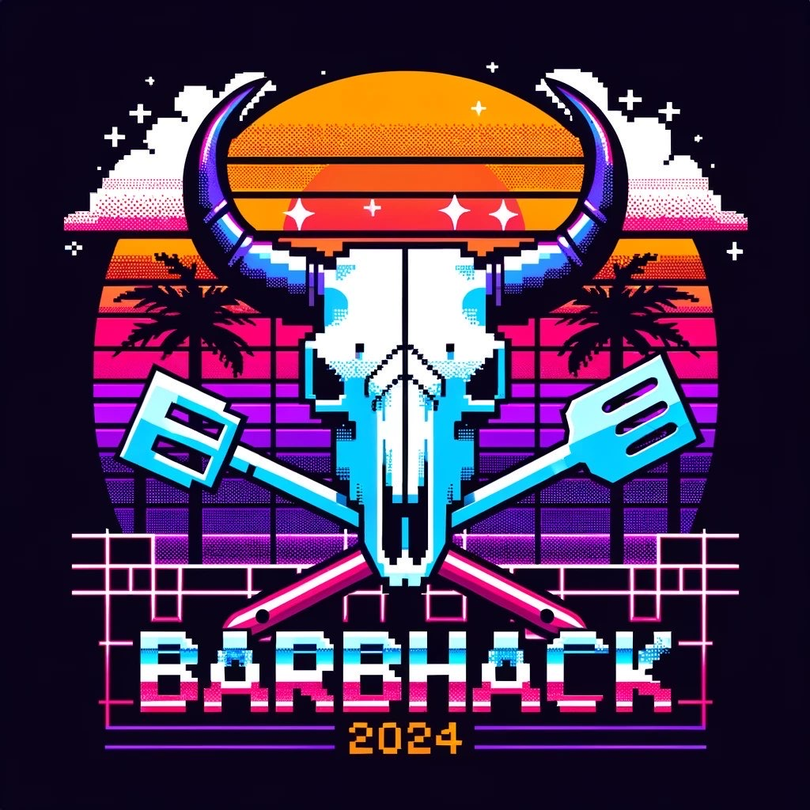

# BarbHack CTF 2024 (Gotham City - Active Directory Lab)

Welcome to the NetExec Active Directory Lab! This lab is designed to teach you how to exploit Active Directory (AD) environments using the powerful tool NetExec.

Originally featured in the Barbhack 2024 CTF, this lab is now available for free to everyone! In this lab, you’ll explore how to use the powerful tool NetExec to efficiently compromise an Active Directory domain during an internal pentest.

The ultimate goal? Become Domain Administrator by following various attack paths !

Obviously do not cheat by looking at the passwords and flags in the recipe files, the lab must start without user to full compromise.

### Public Writeups

- [BarbHack CTF 2024 : Gotham City - Active Directory writeup](https://www.acceis.fr/write-up-barbhack-challenge-active-directory/) by [KlemouLeZoZo](https://kleman.pw/seigneur.html)
- [BarbHack CTF 2024 : Gotham City - Active Directory writeup](https://0xpix3l.github.io/CTFs/GothamCity/) by [0xPix3l](https://x.com/zzziadmo)

There is 13 flags to find in this lab !

### Original pitch

Time compromise Gotham City !

## Install dependencies

> No automatic install is provided as it depend of your package manager and distribution. Here are some install command lines are given for ubuntu.

## Installation

- Installation depend of the provider you use, please follow the appropriate guide :
  - [Install with VmWare](./docs/install_with_vmware.md)
  - [Install with VirtualBox](./docs/install_with_virtualbox.md)
  - [Install with Ludus](./docs/install_with_ludus.md)

- Installation is in three parts :
  1. Templating : this will create the template to use (needed only for proxmox) 
  2. Providing : this will instantiate the virtual machines depending on your provider
  3. Provisioning : it is always made with ansible, it will install all the stuff to create the lab

## Special Thanks to

- Aleem Ladha [@LadhaAleem](https://x.com/LadhaAleem) for creating this project and converting the Barbhack-2024 workshop to an ansible playbook  
- M4yFly [@M4yFly](https://x.com/M4yFly) for the amazing GOAD porject and ansible playbooks (This repo is based on the work of [Mayfly277](https://github.com/Orange-Cyberdefense/GOAD/))
- mpgn [@mpgn_x64](https://x.com/mpgn_x64) for the Barbhack Windows CTF
- NetExec's dev team for this awesome tool !
